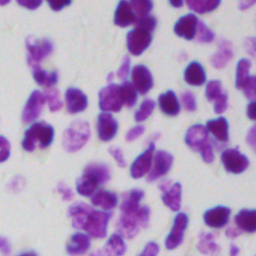
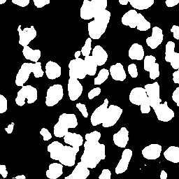

# pytorch-UNet

A tunable implementation of [U-Net](https://arxiv.org/abs/1505.04597) in PyTorch.

- [About U-Net](#unet)
- [U-Net quickstart](#quickstart)
  - [Training](#training)
  - [Predicting](#predicting)
- [Customizing the network](#customizing)
  - [The UNet2D object](#unet2d)
- [Utilities for training the model](#utilities)
  - [Wrapper for training and inference](#wrapper)
  - [Datasets and augmentation transforms](#dataset)
- [Experiments with U-Net](#experiments)
  - [The Kaggle Data Science Bowl 2018 nuclei detection challenge dataset](#dataset)

## About U-Net<a name="unet"></a>

<p align="middle">
  
</p>  
[U-Net](https://arxiv.org/abs/1505.04597) is a powerful encoder-decoder CNN architecture for semantic segmentation, developed by Olaf Ronneberger, 
Philipp Fischer and Thomas Brox. It has won several competitions, for example the ISBI Cell Tracking Challenge 2015 or
the Kaggle Data Science Bowl 2018.   

An example image from the Kaggle Data Science Bowl 2018:
<p align="middle">
  
  
</p>

This repository was created to 
1. provide a reference implementation of 2D and 3D U-Net in PyTorch,
2. allow fast prototyping and hyperparameter tuning by providing an easily parametrizable model. 

In essence, the U-Net is built up using encoder and decoder blocks, each of them consisting of convolutional
and pooling layers. With this implementation, you can build your U-Net using the `First`, `Encoder`, `Center`,
`Decoder` and `Last` blocks, controlling the complexity and the number of these blocks. 
(Because the first, last and the middle of these blocks are somewhat special, they require their own class.)  

**WARNING!** The 3D U-Net implementation is currently untested!  

## U-Net quickstart<a name="quickstart"></a>

The simplest way to use the implemented U-Net is with the provided `train.py` and `predict.py` scripts.  

### Training<a name="training"></a>
For training, `train.py` should be used, where the required arguments are
- `--train_dataset`: path to the training dataset which should be structured like
```
images_folder
   |-- images
       |-- img001.png
       |-- img002.png
       |-- ...
   |-- masks
       |-- img001.png
       |-- img002.png
       |-- ...
```
- `--checkpoint_path`: path to the folder where you wish to save the results (the trained model, predictions
for images in the validation set and log of losses and metrics during training).

Optional arguments:
- `--val_dataset`: path to the validation dataset, having the same structure as the training
dataset indicated above. Defaults to None.
- `--device`: the device where you wish to perform training and inference. Possible values are 'cpu',
'cuda:0', 'cuda:1', etc. Defaults for 'cpu'.
- `--in_channels`: the number of channels in your images. Defaults to 3.
- `--out_channels`: the number of classes in your image. Defaults to 2.
- `--depth`: controls the depth of the network. Defaults to 5. (For detailed explanation, see
[Customizing the network](#customizing).)
- `--width`: the complexity of each block. More width = more filters learned per layer. Defaults to 32. (For detailed explanation, see
[Customizing the network](#customizing).)
- `--epochs`: number of epochs during training. Defaults to 100.
- `--batch_size`: the size of the minibatch during each training loop. Defaults to 1. You should tune this to
completely fill the memory of your GPU.
- `--save_freq`: the frequency of saving the model and predictions. Defaults to 0, which results in not saving
the model at all, only the logs.
- `--save_model`: 1 if you want to save the model at every `save_freq` epochs and 0 if you dont. Defaults to 0. 
- `--model_name`: name of the model. Defaults to `model`. (Useful for parameter tuning.)
- `--learning_rate`: the learning rate for training. Defaults to 1e-3.
- `--crop`: integer describing the size of random crops taken from training and validation images.
Defaults to None, which results in no cropping. For example, if set to 256, the model is trained and
valdiated on (256, 256) sized random crops. 

### Predicting<a name="predicting"></a>
For prediction, the `predict.py` script should be used, where the required arguments are
- `--dataset`: path to the dataset for which you would like to save the predictions.
- `--results_path`: path to the folder where you wish to save the images.
- `--model_path`: path to the saved model which you would like to use for inference.
Optional arguments:
- `--device`: the device where you wish to perform training and inference. Possible values are 'cpu',
'cuda:0', 'cuda:1', etc. Defaults for 'cpu'.

## Customizing the network<a name="customizing"></a>
As you can see on [this figure](https://lmb.informatik.uni-freiburg.de/people/ronneber/u-net/u-net-architecture.png),
the U-Net architecture is basically made from convolution blocks. In the original architecture, the flow
looks like  
<p align="middle">
  1 → 64 → 128 → 256 → 512 → 1024 (channels)<br>
  1024 → 512 → 256 → 128 → 64 → 1 (channels).
</p>  
This is quite arbitrary and it might not be the best architecture for your problem. With the implementation
provided in this repository, this can be changed quickly without requiring you to tweak the code, as you'll
see in the next section.

### The UNet2D object<a name="unet2d"></a>
The 2D [U-Net](https://arxiv.org/abs/1505.04597) architecture is implemented by the `unet.unet.UNet2D`
class. It accepts the following arguments during initialization:
- `in_channels`: the number of channels in your images. (Required)
- `out_channels`: the number of classes in your images. (Required)
- `conv_depths`: a list describing the number of filters learned by the consecutive convolutional blocks.
For example, the original architecture outlined above can be described as `[64, 128, 256, 512, 1024]`.
The argument defaults to this structure.

## Utilities for training the model<a name="utilities"></a>
To save time with writing the usual boilerplate PyTorch code for training, a dataset generator and a
simple wrapper is provided.  

### Wrapper for training and inference<a name="wrapper"></a>
The wrapper is implemented in the `unet.model.Model` object. Upon initialization, you are required to
provide the following arguments:
- `net`: PyTorch model.
- `loss`: loss function which you would like to use during training.
- `optimizer`: optimizer for the training.
- `checkpoint_folder`: folder for saving the results and predictions.

Optional arguments are:
- `scheduler`: learning rate scheduler for the optimizer.
- `device`: The device on which the model and tensor should be located. The default device is the cpu.

To train the model, the `.fit_dataset()` method can be used. For details on how to use it, see its docstring.
To do this, you'll need to use the `unet.dataset.ImageToImage2D` dataset generator, which is described in the
next section. 

### Datasets and augmentation transforms<a name="dataset">
For training the U-Net, simple classes for augmentations and dataset input is implemented. The joint
augmentation transform for image and mask is implemented in `unet.dataset.JointTransform2D`. This transform is
used by the `unet.dataset.ImageToImage2D`. For more details on their usage, see their corresponding docstrings.  

## Experiments with U-Net<a name="experiments"></a>
To get a good grip on U-Net and how it depends on hyperparameters, I have made a simple experiment using the
dataset from the Kaggle Data Science Bowl 2018, which aims to find cell nuclei in microscopy images. Although
the goal of the competition was instance based segmentation which is not exactly the proper use of U-Net, it
actually won the race with some really clever tricks. (For details, see 
[this post by the winner team](https://www.kaggle.com/c/data-science-bowl-2018/discussion/54741), explaining
what they did in detail.)  

For simplicity, the following experiments are focused on a simplified problem: segmenting out nuclei from the
background, disregarding the differences between instances of nuclei.   

### The Kaggle Data Science Bowl 2018 nuclei detection challenge dataset<a name="dataset"></a>
If you would like to play around with the data, you can
[download the images from here](https://www.kaggle.com/c/data-science-bowl-2018/data). Since the ground truth
masks are given for each instance, we need some preprocessing. This can be done with the provided script
`kaggle_dsb18_preprocessing.py`, in the `kaggle_dsb18` folder. It requires two arguments:
- `--dataset_path`: path to the downloaded dataset.
- `--export_path`: path to the folder where you wish to save the results.

The images in this dataset can be subdivided further: fluorescent images, brightfield images and histopathological
images containing tissue. If you also want to make this split, you can find the corresponding image names
in the `kaggle_dsb18` folder.   

